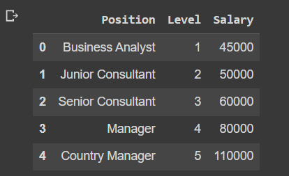
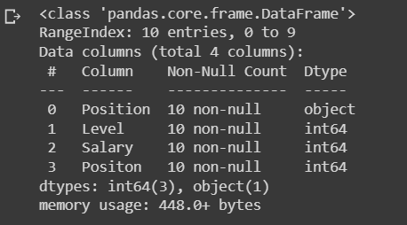
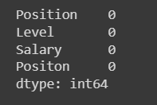
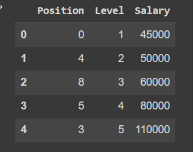
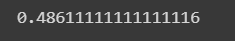
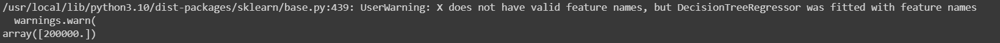

# Implementation-of-Decision-Tree-Regressor-Model-for-Predicting-the-Salary-of-the-Employee

## AIM:
To write a program to implement the Decision Tree Regressor Model for Predicting the Salary of the Employee.

## Equipments Required:
1. Hardware – PCs
2. Anaconda – Python 3.7 Installation / Jupyter notebook

## Algorithm
1. Import the required libraries.
2. Upload the dataset in the compiler and read the dataset.
3. Find head,info and null elements in the dataset.
4. Using LabelEncoder and DecisionTreeRegressor , find MSE and R2 of the dataset.
5. Predict the values and end the program.

## Program:
```
/*
Program to implement the Decision Tree Regressor Model for Predicting the Salary of the Employee.
Developed by: MADHAN BABU P
RegisterNumber:  212222230075
*/
import pandas as pd
df = pd.read_csv('/content/Salary.csv')
df.head()

df.info()

df.isnull().sum()

from sklearn.preprocessing import LabelEncoder
le = LabelEncoder()

df["Position"]=le.fit_transform(df["Position"])
df.head()

x = df[["Position","Level","Salary"]]
x.head()

x = df[["Position","Level"]]
y = df["Salary"]

from sklearn.model_selection import train_test_split
x_train,x_test,y_train,y_test = train_test_split(x,y,test_size=0.2,random_state=2)

from sklearn.tree import DecisionTreeRegressor
dt = DecisionTreeRegressor()
dt.fit(x_train,y_train)
y_pred = dt.predict(x_test)

from sklearn import metrics
mse = metrics.mean_squared_error(y_test,y_pred)
mse

r2 = metrics.r2_score(y_test,y_pred)
r2

dt.predict([[5,6]])
```

## Output:
## df.head value

## df.info()

## df.isnull().sum()

## df.head() for salary

## value of mse

## r value

## data prediction



## Result:
Thus the program to implement the Decision Tree Regressor Model for Predicting the Salary of the Employee is written and verified using python programming.
